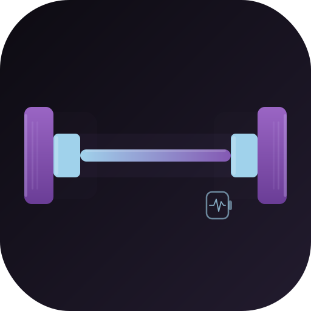

<p align="center">
  
</p>

<h1 align="center">FitnessNiKenneth</h1>

<p align="center">
  <strong>Native iPhone strength tracker with Apple Watch companion.</strong>
</p>

<p align="center">
  <a href="#features">Features</a> •
  <a href="#requirements">Requirements</a> •
  <a href="#quick-start">Quick Start</a> •
  <a href="#usage">Usage</a> •
  <a href="#architecture">Architecture</a> •
  <a href="#development">Development</a> •
  <a href="#license">License</a>
</p>

---

## What is FitnessNiKenneth?

FitnessNiKenneth is a local-first, native iOS strength tracking app built entirely with SwiftUI and SwiftData — no third-party dependencies, no cloud sync, no ads. Log workouts from templates, track PRs automatically, and monitor your session in real time from your Apple Watch.

- **Workout templates** — build reusable routines with ordered exercises and target sets
- **Active workout engine** — live timer, per-set logging, rest timer, set tags (warmup / drop set / failure)
- **Automatic PRs** — estimated 1RM (Epley formula) compared against your personal bests after every session
- **Analytics** — total volume, best set, and 1RM progression charts per exercise
- **Apple Watch companion** — see live workout state, rest timer, and current set on your wrist
- **History** — calendar view + full session detail for every past workout

## Features

- Template CRUD with exercise ordering
- Live workout session with elapsed timer
- Per-exercise rest timer with visual countdown
- Set tagging: Normal, Warmup, Drop Set, To Failure
- Weight unit toggle: kg / lbs (persisted per session)
- Estimated 1RM and volume analytics via Swift Charts
- PR detection on session finish
- Apple Watch companion via WatchConnectivity (read-only, no SwiftData on Watch)
- Local-only SwiftData persistence (no iCloud, no HealthKit in v1)
- Nocturnal Cryo-Lab dark theme

## Requirements

- **Xcode 16+** (Swift 6, Swift Testing framework)
- **iOS 18.0+** — SwiftData and Swift Charts
- **watchOS 11.0+** — for Watch companion (optional)
- **XcodeGen 2.x** — project file is generated, not committed

## Quick Start

```bash
# Install XcodeGen (if not installed)
brew install xcodegen

# Generate Xcode project
xcodegen generate

# Open in Xcode
open FitnessNiKenneth.xcodeproj
```

Select the **FitnessNiKenneth** scheme with an iPhone 18+ simulator and run.

For the Watch companion, select **FitnessNiKenneth (Full)** with a watchOS 11+ simulator paired to the iPhone simulator.

## Usage

### Starting a Workout

1. Open the **Workout** tab
2. Tap a template to start a session
3. The active workout screen opens with a live elapsed timer

### Logging Sets

- Each exercise row shows target sets in a table: Set # / Weight / Reps / Done
- Tap a weight or rep field to edit inline
- Tap the checkmark to complete a set — the row turns purple and the rest timer starts
- Long-press the set row to assign a tag (Warmup, Drop Set, To Failure)

### Finish / Cancel

- **Finish** — writes the entire session to SwiftData, evaluates PRs, navigates to the history detail
- **Cancel** — discards all in-memory state with no writes

### Analytics

Open the **Exercises** tab → tap any exercise → **Analytics** tab to see:
- Estimated 1RM over time
- Total volume per session
- Best set (highest estimated 1RM)

## Architecture

```
FitnessNiKenneth/
├── App/                    Entry point, tab root
├── Core/
│   ├── Models/             SwiftData entities
│   │   ├── Exercise
│   │   ├── WorkoutTemplate / TemplateExercise
│   │   ├── WorkoutSession / WorkoutExercise / WorkoutSet
│   │   └── SharedTypes (WeightUnit, SetTag, etc.)
│   ├── Services/
│   │   ├── WorkoutEngine          @Observable @MainActor live session state
│   │   ├── AnalyticsService       Pure-function 1RM, volume, PR derivation
│   │   ├── SeedDataService        Idempotent seed: 30+ exercises, 4 templates
│   │   └── WatchConnectivityService
│   └── Design/
│       ├── AppTheme               Nocturnal Cryo-Lab palette + typography
│       └── Components             AppButton, EmptyStateView
└── Features/
    ├── History/            Session list, calendar, detail
    ├── Workout/            Templates + ActiveWorkout engine UI
    └── Exercises/          Library, detail, analytics

FitnessNiKennethWatch/
├── App/                    Watch entry point
├── Views/                  WatchRootView, WatchActiveWorkoutView
└── Services/               WatchWorkoutEngine (WatchConnectivity receiver)

FitnessNiKennethTests/      34 unit tests — Swift Testing framework
```

### Key Design Decisions

| Decision | Rationale |
|----------|-----------|
| `WorkoutEngine` is `@Observable @MainActor` | Owns all live session state in memory; single SwiftData write on Finish for max UI speed |
| Analytics derived at read time | No separate PR store to drift out of sync |
| SwiftData enums as raw `String` | `#Predicate` compatibility; computed properties expose typed values |
| Watch never writes SwiftData | WatchConnectivity push only; avoids multi-process SwiftData conflicts |
| `VersionedSchema` from day one | Safe lightweight migrations as schema evolves post-v1 |

## Development

### Prerequisites

- Xcode 16.0+
- `brew install xcodegen`

### Build (iOS Simulator)

```bash
xcodegen generate
xcodebuild \
  -project FitnessNiKenneth.xcodeproj \
  -target FitnessNiKenneth \
  -destination 'platform=iOS Simulator,name=iPhone 17 Pro' \
  CODE_SIGNING_ALLOWED=NO \
  build
```

### Test

```bash
xcodebuild test \
  -project FitnessNiKenneth.xcodeproj \
  -scheme FitnessNiKenneth \
  -destination 'platform=iOS Simulator,name=iPhone 17 Pro' \
  -only-testing:FitnessNiKennethTests \
  CODE_SIGNING_ALLOWED=NO
```

### After Schema or Target Changes

```bash
xcodegen generate
```

Never edit `.xcodeproj` directly — always edit `project.yml` then regenerate.

### Commit Style

```
feat(workout): add drop-set tag to set row
fix(engine): prevent duplicate rest timer on set undo
test(analytics): add 1RM edge cases for zero reps
chore: bump minimum iOS to 18.2
```

## Project Structure

| Directory | Purpose |
|-----------|---------|
| `FitnessNiKenneth/` | Main iOS app target |
| `FitnessNiKennethWatch/` | watchOS companion target |
| `FitnessNiKennethTests/` | Unit tests (Swift Testing) |
| `FitnessNiKennethUITests/` | UI tests (XCTest) |
| `docs/` | Architecture, release checklist, exercise content strategy |
| `tasks/` | Planning files, lessons, findings |
| `project.yml` | XcodeGen source of truth |

## Release

See `docs/RELEASE_CHECKLIST.md` for the full TestFlight and App Store checklist.

Key steps before submitting:
1. Set `DEVELOPMENT_TEAM` in `project.yml`
2. Add 1024×1024 `AppIcon` to `Assets.xcassets`
3. Add `PrivacyInfo.xcprivacy` (no data collected)
4. Archive with **FitnessNiKenneth (Full)** scheme (embeds Watch app)
5. Distribute via Xcode Organizer → TestFlight

## License

MIT
